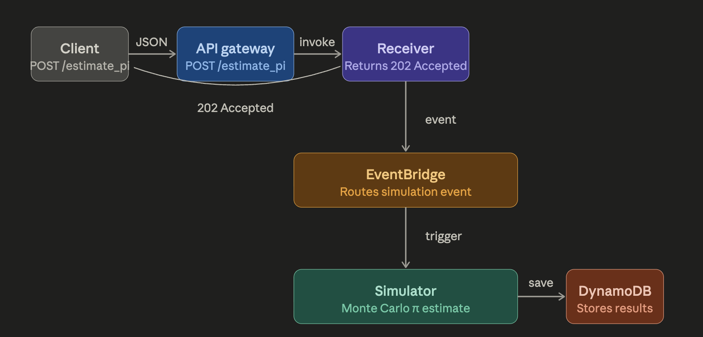

# Math as a Service (MaaS) — SWE 455 Homework 2

## Architecture



**Flow:**
1. Client sends `POST /estimate_pi` with `{"total_points": N}`
2. API Gateway routes request to Receiver Lambda
3. Receiver Lambda returns `202 Accepted` immediately
4. Receiver publishes event to EventBridge
5. EventBridge triggers Simulator Lambda
6. Simulator runs Monte Carlo π estimation and saves result to DynamoDB

## Components

| Component | AWS Service |
|---|---|
| API Gateway | AWS API Gateway v2 (HTTP) |
| Receiver Service | AWS Lambda (Python 3.11) |
| Event Bridge | AWS EventBridge |
| Simulator Service | AWS Lambda (Python 3.11) |
| Data Store | AWS DynamoDB |

## Files

- `receiver/app.py` — Receiver Lambda source code
- `receiver/Dockerfile` — Receiver Docker image
- `simulator/app.py` — Simulator Lambda source code
- `simulator/Dockerfile` — Simulator Docker image
- `main.tf` — Terraform infrastructure definition

## Deployment

```bash
terraform init
terraform apply -auto-approve
```

## Load Test

Sent 50 requests with `total_points=10,000,000` each.
Results visible in CloudWatch logs under `/aws/lambda/maas-receiver`.

## API

**Endpoint:** `https://c78mk8fxkb.execute-api.us-east-1.amazonaws.com/estimate_pi`

**Request:**
```json
POST /estimate_pi
{"total_points": 10000000}
```

**Response:**
```json
HTTP 202 Accepted
{"message": "Accepted"}
```
